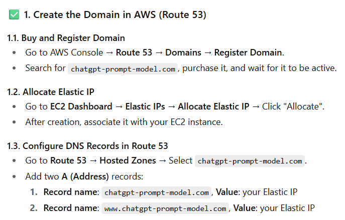

# ChatGPTPromptModel 
# Model for the Adoption of AI Tools in the Software Development Life Cycle. Usage, Analysis and Proposals for ChatGPT Optimization.

\begin{justify}
One of the most important phases in the software development life cycle is system deployment. However, developers often lack sufficient experience or clear guidance on how to configure a server, manage a domain, or correctly deploy their application in a production environment. This process can involve a number of technical challenges, such as assigning a static IP, configuring DNS, installing security certificates, or even managing server ports and services. Given these difficulties, the use of artificial intelligence tools such as ChatGPT becomes a valuable ally, as it can generate detailed instructions, resolve specific questions, and adapt recommendations to the technological environment we are using.

In this context, the artifact proposed in the article allows for the structuring of effective prompts that guide the developer through this critical stage, facilitating task automation, decision-making, and understanding of the deployment process, even for those without specialized training in infrastructure.

\end{justify}

**Proof of Concept 3: Application Deployment**

 In proof of concept number 3, the AI was given the necessary instructions to generate a series of steps for deploying an application developed in Spring Boot on an AWS server.

    

  

    

The generated prompt gave us a satisfactory result because it generated the steps required to configure a deployment environment with AWS for an application developed in SpringBoot in a way that was understandable to the developer.
It correctly generated a guide that helps configure a deployment environment in the aforementioned technologies, in simple steps.

    

In the first section ChatGPT shows the steps for creating a domain in AWS, from registration to DNS configuration.

    

We looked for the <i>chatgpt-prompt-model.com</i> domain, but it was already taken, so we chose <strong>.org.</strong> 

    

Once the domain is registered, it can be viewed in the list of domains in AWS, then we continue with the assignment of the elastic IP and the configuration of the domain records.

    

Once the domain is registered, it can be viewed in the list of domains in AWS, then we continue with the assignment of the elastic IP and the configuration of the domain records.

